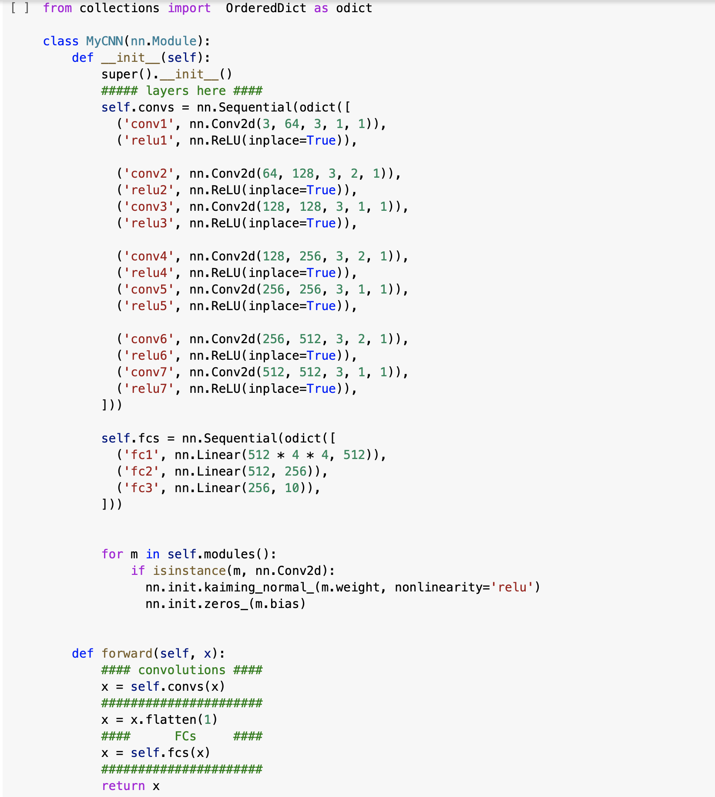
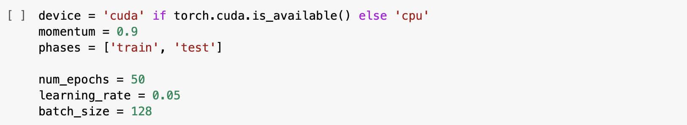
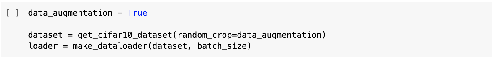
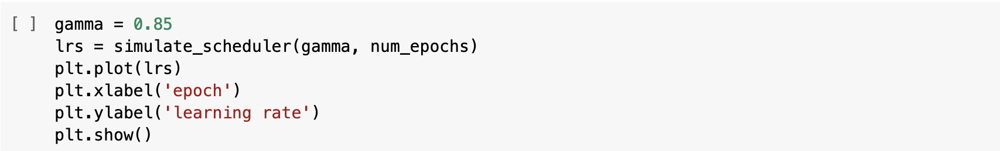

# AI-

Model 만들기 : 

● Convolution layer의 out_channels를 조절하였습니다.
● Fully connected layer(nn.Linear)의 features 조절하였습니다.

Hyperparameters : 

● Epoch, learning rate, batch_size 조절하였습니다.

Data Augmentation : 

Learning rate scheduling : 

● gamma를 조절하였습니다.

다음은 코드 수행 결과입니다 :

